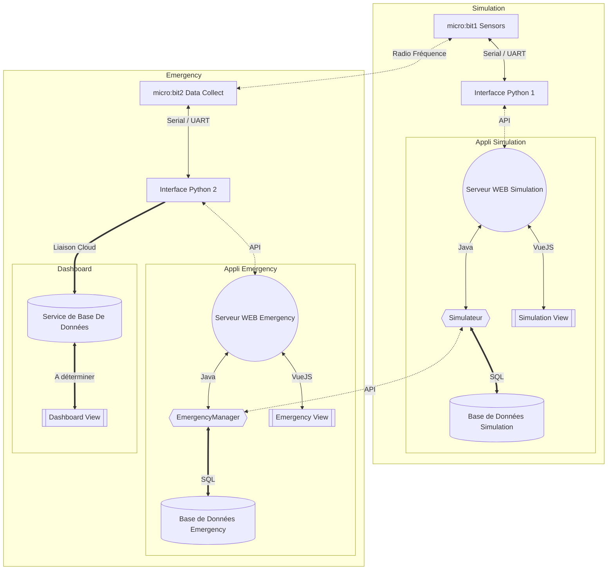

# Projet Scientifique Equipe n°9

## Architecture du projet et technologies utilisées

```mermaid
graph TB
    
    %% Lien entre zones
    mb1[micro:bit1 Sensors] <-. Radio Fréquence .-> mb2[micro:bit2 Data Collect]
    simu <-. API .-> em
    
    %% Zone simu
    subgraph one [Simulation]
        mb1 <-- Serial / UART --> py1[Interfacce Python 1]
        py1 <-. API .-> web1((Serveur WEB Simulation))
        subgraph app1 [Appli Simulation]
            web1 <-- VueJS --> wv1[[Simulation View]]
            web1 <-- Java --> simu{{Simulateur}}
            simu <== SQL ==> bdd1[(Base de Données Simulation)]
        end 
    end

    %% Zone Urgence
    subgraph two [Emergency]
        mb2 <-- Serial / UART --> py2[Interface Python 2]
        subgraph app2 [Appli Emergency]
            web2 <-- VueJS --> wv2[[Emergency View]]
            web2 <-- Java --> em{{EmergencyManager}}
            em <== SQL ==> bdd2[(Base de Données Emergency)]
        end
        py2 <-. API .-> web2((Serveur WEB Emergency))
        py2 == Liaison Cloud ==> bdd3[(Service de Base De Données)]
        subgraph dashboard [Dashboard]
            bdd3 <== A déterminer ==> db[[Dashboard View]]
        end
    end
```